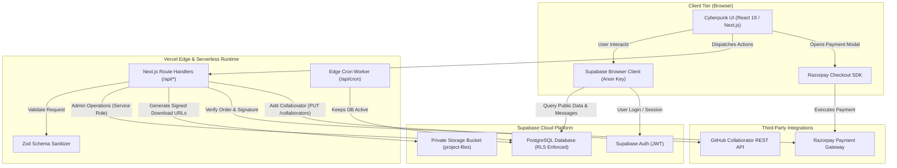
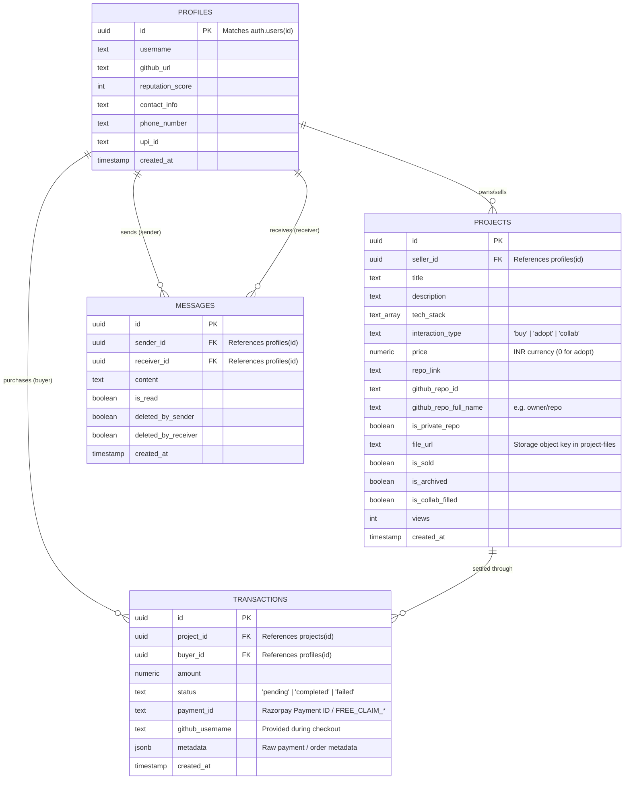
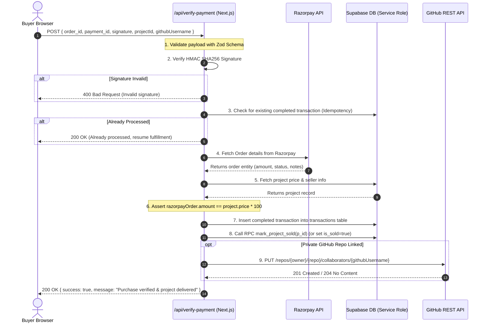
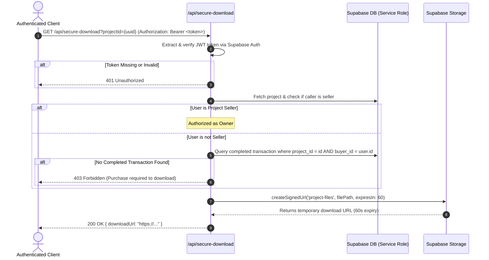
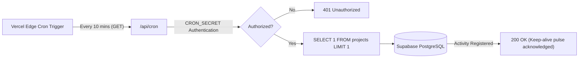

# System Architecture & Technical Design Document
## The Graveyard — Where Dead Code Lives Again

> [!NOTE]
> This document mirrors [architecture.md](file:///d:/the-graveyard/architecture.md) for direct accessibility and reference under both standard and project-requested filenames.

---

### Document Information
- **System Name:** The Graveyard Architecture
- **Version:** 1.0.0
- **Status:** Production Standard
- **Runtime Environment:** Next.js (App Router / Node.js & Edge Serverless)
- **Primary Database & Auth:** Supabase (PostgreSQL with Row Level Security)
- **External Services:** Razorpay Payments API, GitHub REST API v3, Vercel Edge Cron
- **Last Updated:** October 2026

---

## 1. High-Level Architecture Overview

The Graveyard is structured as a full-stack, event-driven web application utilizing Next.js App Router for frontend UI and backend API routes, coupled with Supabase for relational data storage, authentication, real-time messaging, and secure object storage.



---

## 2. Data Architecture & Database Schema

The database relies on PostgreSQL managed via Supabase, with **Row Level Security (RLS)** active across every table to prevent unauthorized data manipulation or reads.

### 2.1 Entity Relationship Diagram (ERD)



---

### 2.2 Integrity Constraints & Indexes

1. **Unique Completed Purchase Constraint:**
   ```sql
   CREATE UNIQUE INDEX unique_completed_project_purchase 
   ON public.transactions (project_id) 
   WHERE (status = 'completed');
   ```
   *Guarantees a listed project cannot be double-sold or settled concurrently.*

2. **Unique Payment ID Index:**
   ```sql
   CREATE UNIQUE INDEX unique_payment_id_idx 
   ON public.transactions (payment_id) 
   WHERE (payment_id IS NOT NULL);
   ```
   *Prevents replay attacks using an existing Razorpay transaction identifier.*

---

## 3. Row Level Security (RLS) Policy Matrix

| Table | Policy Name | Command | Access Criteria / Rule |
|:---|:---|:---|:---|
| **profiles** | "Public profiles are viewable by everyone" | `SELECT` | `true` |
| **profiles** | "Users can insert their own profile" | `INSERT` | `auth.uid() = id` |
| **profiles** | "Users can update own profile" | `UPDATE` | `auth.uid() = id` |
| **projects** | "Projects are viewable by everyone" | `SELECT` | `true` |
| **projects** | "Users can insert their own projects" | `INSERT` | `auth.uid() = seller_id` |
| **projects** | "Sellers can update own projects" | `UPDATE` | `auth.uid() = seller_id` |
| **projects** | "Sellers can delete own projects" | `DELETE` | `auth.uid() = seller_id` |
| **transactions**| "Users can view transactions they are involved in" | `SELECT` | `auth.uid() = buyer_id OR projects.seller_id = auth.uid()` |
| **transactions**| "Users can insert pending transactions" | `INSERT` | `auth.uid() = buyer_id AND status = 'pending'` |
| **transactions**| "Sellers can update transactions for their projects" | `UPDATE` | `projects.seller_id = auth.uid()` |
| **messages** | "Users can read their own non-deleted messages" | `SELECT` | `(sender_id = auth.uid() AND !deleted_by_sender) OR (receiver_id = auth.uid() AND !deleted_by_receiver)` |
| **messages** | "Users can send messages" | `INSERT` | `auth.uid() = sender_id` |
| **messages** | "Senders can mark messages as deleted" | `UPDATE` | `auth.uid() = sender_id` |
| **messages** | "Receivers can update read and deleted status" | `UPDATE` | `auth.uid() = receiver_id` |
| **storage.objects**| "Authenticated users can upload project files" | `INSERT` | `bucket_id = 'project-files'` |
| **storage.objects**| "Users can manage own uploaded files" | `SELECT / UPDATE / DELETE` | `bucket_id = 'project-files' AND auth.uid() = owner` |

---

## 4. Core Backend Subsystems & Workflows

### 4.1 Payment Verification & Fulfillment Sequence (`/api/verify-payment`)



---

### 4.2 Secure Download Gateway (`/api/secure-download`)

To safeguard digital assets, direct public access to Supabase storage is disabled. Download links are dynamically minted through this gateway:



---

### 4.3 Database Keep-Alive Daemon (`/api/cron`)

Free-tier managed databases automatically pause after a period of dormancy. The Graveyard incorporates an automated Edge Cron ping:



---

## 5. Security & Isolation Architecture

1. **Dual-Key Isolation Model:**
   - `NEXT_PUBLIC_SUPABASE_ANON_KEY`: Exposed to frontend. Governed strictly by PostgreSQL Row Level Security.
   - `SUPABASE_SERVICE_ROLE_KEY`: Guarded strictly on the server side. Used only inside API route handlers to perform administrative tasks (such as atomic transaction insertion, order settlements, and signed URL generation).
2. **Payment Tampering Defenses:**
   - Client-reported prices are never trusted. The server retrieves the registered project price directly from PostgreSQL and verifies that the Razorpay order price in paise matches `project.price * 100`.
   - Razorpay signatures are verified using `crypto.createHmac('sha256', secret)` before any database mutation occurs.
3. **Storage Access Lockdown:**
   - Bucket `project-files` has `public = false`.
   - Direct anonymous access to storage objects returns HTTP 403.
   - All downloads require verified buyer authentication and yield signed URLs with a maximum TTL of 60 seconds.

---

## 6. Deployment & Infrastructure Matrix

| Layer | Provider | Configuration / Specs |
|:---|:---|:---|
| **Frontend & API Routes** | Vercel | Next.js App Router, Node.js runtime, Edge middleware |
| **Relational Database** | Supabase Cloud | PostgreSQL 15, PgBouncer Connection Pooling (Port 6543) |
| **Storage & Assets** | Supabase Storage | S3-compatible private object store (`project-files` bucket) |
| **Payment Gateway** | Razorpay | Standard Checkout SDK, Webhook verification |
| **Repository Automation** | GitHub API | Personal Access Token (PAT) with repo scope permissions |
| **Scheduled Tasks** | Vercel Cron | Configured in `vercel.json` targeting `/api/cron` |

---

## 7. Configuration & Environment Variables

| Variable | Scope | Description |
|:---|:---|:---|
| `NEXT_PUBLIC_SUPABASE_URL` | Public / Client | Supabase project URL |
| `NEXT_PUBLIC_SUPABASE_ANON_KEY` | Public / Client | Supabase anonymous public API key |
| `SUPABASE_SERVICE_ROLE_KEY` | Private / Server | Supabase administrative key (Bypasses RLS) |
| `NEXT_PUBLIC_RAZORPAY_KEY_ID` | Public / Client | Razorpay public Key ID for checkout popup |
| `RAZORPAY_KEY_SECRET` | Private / Server | Razorpay Secret for HMAC verification |
| `GITHUB_ACCESS_TOKEN` | Private / Server | Scoped GitHub Personal Access Token for invitations |
| `CRON_SECRET` | Private / Server | Shared secret token validating Vercel cron triggers |
