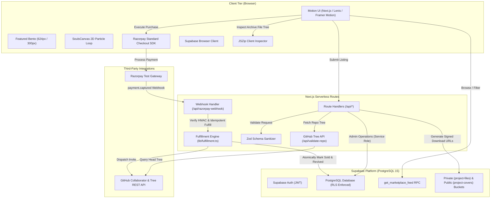

# System Architecture & Technical Design Document
## The Graveyard — V2.2 Motion-Forward Developer Platform

---

### Document Information
- **System Name:** The Graveyard Architecture
- **Version:** 2.2.0
- **Status:** Production Standard
- **Runtime Environment:** Next.js 16 (App Router / Node.js & Edge Serverless)
- **Primary Database & Auth:** Supabase (PostgreSQL with Row Level Security)
- **External Services:** Razorpay Payments API, GitHub REST API v3, Vercel Edge Cron, Sharp, JSZip
- **Last Updated:** October 2026

---

## 1. High-Level Architecture Overview

The Graveyard V2.2 is structured as a full-stack, event-driven web application featuring:
1. **Frontend Experience**: Editorial, motion-forward Next.js App Router application with Lenis smooth scroll, 2D canvas particle simulation, SplitText masked reveals, deterministic CoverArt, View Transitions API, and an even 624px/300px bento featured grid.
2. **Synchronized Feed Engine**: `get_marketplace_feed(...)` RPC returning query results and mode counts in a single unified atomic query, eliminating count discrepancies.
3. **Database Tier**: Supabase PostgreSQL with strict RLS, immutable column triggers, integer paise pricing, tombstone telemetry, and comprehensive project details.
4. **Fulfillment Engine**: Idempotent webhook handler verifying Razorpay HMAC SHA256 signatures, dispatching automated GitHub collaborator invites, generating signed archive download URLs, and sending Realtime notifications.
5. **Procedural Seeding & Mock Assets**: High-resolution wireframe mock generator using `sharp` and strict archive validation using `jszip`.

---

## 2. Database Schema & Data Models

### 2.1 Project Details Schema (`20261001020000_graveyard_v4_details.sql`)
The migration extends the `projects` table with rich engineering metadata:

| Column | Type | Constraints & Defaults | Usage / Purpose |
|---|---|---|---|
| `tagline` | `text` | Max 120 chars | One-line pitch shown on cards |
| `completion_percent` | `smallint` | `CHECK (0 <= val <= 100)` | Progress percentage on cover chips and stats |
| `lines_of_code` | `integer` | Positive integer | Total LOC rendered with `formatLOC()` |
| `features` | `text[]` | `DEFAULT '{}'` | "What works" feature list |
| `todo_items` | `text[]` | `DEFAULT '{}'` | "What's left / Known gaps" checklist |
| `setup_notes` | `text` | Markdown | Environment variables and run instructions |
| `screenshots` | `text[]` | Max 6 URLs | Gallery preview and modal lightbox |
| `file_tree` | `jsonb` | Max 300 path entries | Collapsible file tree explorer |
| `collab_roles` | `jsonb` | Array of `{ role, commitment, description }` | Co-founder role cards |
| `is_featured` | `boolean` | `DEFAULT false` | Protected editorial curation flag |
| `featured_rank` | `smallint` | Nullable order index | Featured listing priority |
| `seed_key` | `text UNIQUE` | Nullable unique index | Idempotent demo seeding identifier |

### 2.2 Security & Protection Triggers
1. **Seller Permissions**: Sellers may freely update `tagline`, `completion_percent`, `lines_of_code`, `features`, `todo_items`, `setup_notes`, `screenshots`, `file_tree`, and `collab_roles` on their own listings.
2. **Protected Columns**: An immutable PostgreSQL trigger ensures that **only the service role** may modify `is_featured`, `featured_rank`, `seed_key`, `is_sold`, `sold_at`, `revived_at`, `has_repo`, `repo_owner`, `repo_name`, and `last_commit_at`.
3. **Storage Policies**:
   - `project-covers`: Public read. Uploads restricted to `image/png`, `image/jpeg`, `image/webp`, max 2MB per file, isolated to `auth.uid()/...` paths.
   - `project-files`: Private bucket. Uploads restricted to authenticated sellers. Downloads mediated exclusively by signed server-generated URLs.

---

## 3. Featured Section & Layout Architecture

### 3.1 Featured Selection Algorithm (`src/lib/featured.ts`)
- Returns up to 3 live listings with `is_featured = true` ordered by `featured_rank ASC`.
- If fewer than 3 featured listings exist, automatically fills remaining slots using the most-viewed live listings, ensuring diversity across interaction modes (`buy`, `adopt`, `collab`).
- Strictly excludes sold, claimed, filled, or archived projects.

### 3.2 Fixed-Height Bento Grid
- **Desktop (`lg+`)**: 12-column grid with a fixed row height of 300px and a 24px gap.
  - Large card: Columns 1–7, spans 2 rows (624px tall). Cover takes top ~55% with absolute fill; content area (28px padding) contains title, tagline, tech pills, tombstone telemetry, and epitaph pull-quote with gradient scrim.
  - Compact cards (2): Columns 8–12, span 1 row each (300px tall). Horizontal split: 42% cover width stretching full card height; 58% content column with pinned footer.
- **Fallbacks**:
  - 2 items: Two equal 300px cards side-by-side.
  - 1 item: Full-width curated card.
  - 0 items: Section completely unmounts.
- **Universal `CardFooter`**: Standardized across large, compact, regular, and resurrected cards. Left: seller avatar + @username. Right: tabular price / collab terms pill + 40px circular arrow button with hover nudge.

---

## 4. Archive & File Tree Inspection Architecture

1. **Client-Side Zip Inspection**: In the publish wizard, `JSZip` asynchronously parses the seller's uploaded archive directly in the browser:
   - Traverses entries to build a flat list of relative file paths.
   - Automatically filters out sensitive and dependency paths matching `.env*`, `node_modules/`, `.git/`, `.DS_Store`, `Thumbs.db`.
   - Allows sellers to review and toggle visibility of file paths before publishing.
   - Caps stored paths at 300 entries.
2. **Server-Side GitHub Tree Retrieval**: For verified GitHub repositories, the server queries `GET /repos/{owner}/{repo}/git/trees/HEAD?recursive=1` using the platform PAT:
   - Sanitizes and filters sensitive files.
   - Stores up to 300 paths in `file_tree`.
3. **Download Assertion**: The demo seed script verifies that every downloadable zip archive strictly contains the paths declared in `file_tree`.
