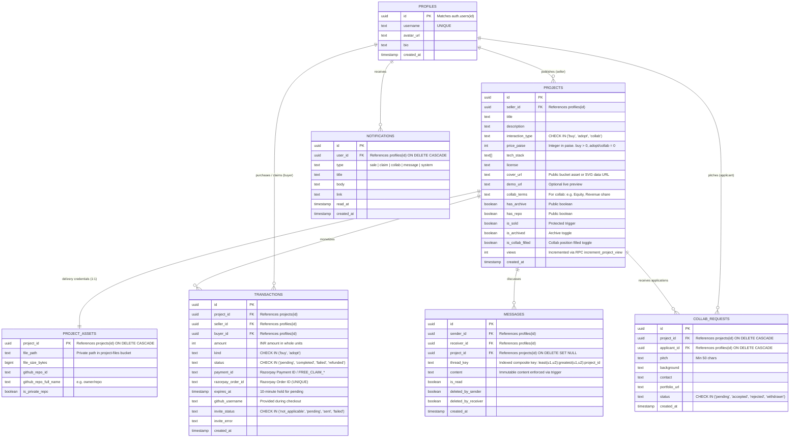
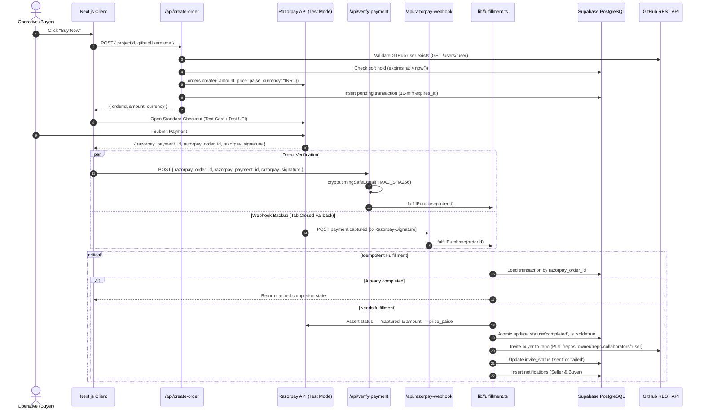

# The Graveyard: System Architecture Specification (v2.0)

## 1. System Overview & Technology Stack

The Graveyard is an industrial cyberpunk marketplace for resurrecting abandoned software. The application is built on:
- **Frontend / Fullstack Framework:** Next.js (App Router, React 19, TypeScript strict mode)
- **Styling & UI:** Tailwind CSS, Radix UI primitives, Lucide Icons, Sonner
- **Database & Auth:** Supabase (PostgreSQL 15, Row Level Security, Realtime WebSockets)
- **Storage:** Supabase Storage (Private `project-files`, Public `project-covers` max 2MB)
- **Payments:** Razorpay Standard Checkout (TEST MODE only, zero live currency, INR paise integers)
- **Source Management:** GitHub REST API (v3) with automated collaborator invitations
- **Automation:** Edge Cron jobs via Vercel (`0 3 * * *`)

---

## 2. Entity-Relationship Model (v2)



---

## 3. Database Security & Integrity Rules

### 3.1 Unique Constraints & Anti-Double-Sale
- **Single Buyer for For Sale (`buy`):**
  ```sql
  CREATE UNIQUE INDEX unique_completed_project_purchase 
  ON public.transactions (project_id) 
  WHERE (status = 'completed' AND kind = 'buy');
  ```
- **Single Claim Per User for Free Fork (`adopt`):**
  ```sql
  CREATE UNIQUE INDEX unique_user_adopt_claim 
  ON public.transactions (project_id, buyer_id) 
  WHERE (status = 'completed' AND kind = 'adopt');
  ```
- **Unique Collab Application Per Operative:**
  ```sql
  CONSTRAINT unique_project_applicant UNIQUE (project_id, applicant_id)
  ```

### 3.2 Delivery Isolation (`project_assets`)
Delivery coordinates (`file_path`, `github_repo_full_name`, `is_private_repo`) are strictly separated from `projects`.
- **Public `projects` table:** Only exposes `has_archive: boolean` and `has_repo: boolean`.
- **`project_assets` table:** Secured via RLS:
  - Seller can `SELECT`, `INSERT`, `UPDATE`, `DELETE`.
  - Entitled buyer (with `status = 'completed'` transaction) can `SELECT`.
  - Strangers receive zero records.

### 3.3 Column Protection Triggers
A `BEFORE UPDATE` trigger on `projects` protects sensitive operational fields from client tampering unless `auth.role() = 'service_role'`:
- Cannot alter: `seller_id`, `is_sold`, `views`, `interaction_type`, `price_paise`, `created_at`.
- Seller can update: `title`, `description`, `tech_stack`, `cover_url`, `demo_url`, `is_collab_filled`, `is_archived`.
- Views are incremented exclusively through the `increment_project_view(p_id)` RPC (ignoring seller self-views).

---

## 4. Fulfillment & Payment Engine



---

## 5. Cron & Keep-Alive Automation
To ensure Supabase free-tier PostgreSQL databases remain active, Vercel Cron executes:
- **Frequency:** Daily at 03:00 UTC (`0 3 * * *` in `vercel.json`)
- **Route:** `/api/cron` (and alias `/api/cron/ping`)
- **Authorization:** `Authorization: Bearer <CRON_SECRET>`
- **Action:** Issues lightweight query `SELECT count(*) FROM projects` and prunes expired pending checkout holds older than 24 hours.
