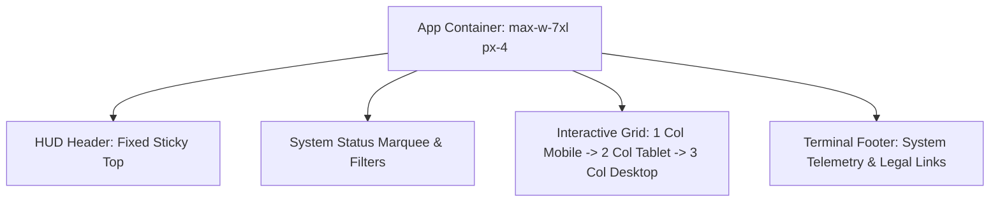

# Design System & UI/UX Specification
## The Graveyard — Industrial Cyberpunk Interface System

---

### Document Information
- **Design System Name:** Graveyard Cyber-OS
- **Version:** 1.0.0
- **Status:** Production Standard
- **Primary Design Paradigm:** Industrial Cyberpunk / High-Contrast Terminal / Dystopian HUD
- **Target Formats:** Web (Desktop, Tablet, Mobile)
- **Last Updated:** October 2026

---

## 1. Design Philosophy & Brand Identity

The Graveyard rejects generic minimalist SaaS design tropes in favor of an **uncompromising, tactile, industrial cyberpunk aesthetic**. It mimics a high-security black-market terminal where decommissioned software repositories are scavenged, traded, and revived.

### 1.1 Core Tenets
1. **The Terminal Reality:** Every surface is dark, dense, and purposeful. Monospace data readouts, clipped polygonal borders, and telemetry badges communicate technical precision.
2. **Luminescent Accents:** High-intensity neon green (`#39ff14`) and laser red (`#ff2a2a`) pierce through deep void backdrops, signaling live actions, critical statuses, and interactive pathways.
3. **Mechanical Tactility:** Buttons cut inward at 45-degree chamfers; hover states trigger glitch jitters and soft glowing halos rather than generic standard fades.
4. **Cinematic Immersion:** Subtle scanlines, ambient flickering, and glowing radar pings give users the sensation of operating inside a live dystopian command console.

---

## 2. Color Palette & Token System

### 2.1 Core Cyber Palette

| Token Name | HEX | HSL Equivalent | Role & Application |
|:---|:---|:---|:---|
| `--cyber-black` | `#0a0a0a` | `hsl(0, 0%, 4%)` | Primary canvas & root background void |
| `--cyber-dark` | `#151515` | `hsl(0, 0%, 8%)` | Surface cards, elevated panels, dialog containers |
| `--cyber-red` | `#ff2a2a` | `hsl(0, 84%, 58%)` | Primary brand accent, warning strips, laser glow buttons, destructive actions |
| `--cyber-neon` | `#39ff14` | `hsl(110, 100%, 55%)` | Secondary brand accent, purchase buttons, success states, verified metrics |
| `--cyber-gray` | `#2d2d2d` | `hsl(0, 0%, 18%)` | Outer borders, divider lines, disabled buttons, subtle surfaces |
| `--cyber-muted` | `#6b7280` | `hsl(215, 14%, 46%)` | Secondary typography, telemetry labels, placeholder text |
| `--foreground` | `#ededed` | `hsl(0, 0%, 90%)` | High-contrast readable text copy |

### 2.2 Interaction Color Semantics

| Mode | Accent Color | Glow Token | Psychological Cue |
|:---|:---|:---|:---|
| **BUY** | `#39ff14` (Neon Green) | `box-shadow: 0 0 20px rgba(57, 255, 20, 0.5)` | High-value commercial transaction, liquidity |
| **ADOPT** | `#2d2d2d` (Cyber Gray) | `box-shadow: 0 0 10px rgba(255, 255, 255, 0.1)` | Open-source adoption, community ownership |
| **COLLAB** | `#3b82f6` (Electric Blue)| `box-shadow: 0 0 20px rgba(59, 130, 246, 0.5)` | Partnership, team synchronization, operative match |

### 2.3 Glow Effects

```css
/* Glow Definitions in Tailwind / CSS */
--glow-red: 0 0 20px hsl(0 84% 58% / 0.5);
--glow-neon: 0 0 20px hsl(110 100% 55% / 0.5);
--glow-subtle: 0 0 10px hsl(0 84% 58% / 0.3);
```

---

## 3. Typography & Monospace Telemetry

### 3.1 Font Families

```
+---------------------------------------------------------------------------------+
| HEADINGS & DISPLAY: 'Bricolage Grotesque', sans-serif                           |
| Humanist sans with personality, tight tracking for editorial display.          |
| Used for: Page Titles, Card Titles, Brand Logo, Display Headings.               |
+---------------------------------------------------------------------------------+
| BODY & TELEMETRY: 'Geist', 'Geist Mono', monospace                              |
| Ultra-clean modern sans and precision mono for telemetry and body.              |
| Used for: Descriptions, Prices, Tech Badges, System Readouts, Data Tables.     |
+---------------------------------------------------------------------------------+
```

### 3.2 Type Hierarchy

| Style Level | Font Family | Size | Weight | Tracking / Transform | Example Application |
|:---|:---|:---|:---|:---|:---|
| **Display Hero** | Bricolage Grotesque | 3rem - 4.5rem (48-72px) | Bold (700) | `tracking-tight` | Hero banner headline |
| **H1 Section** | Bricolage Grotesque | 2rem - 2.5rem (32-40px) | Bold (700) | `tracking-tight` | Dashboard & Explore headers |
| **H2 Card Title** | Geist | 1.25rem - 1.5rem (20-24px)| SemiBold (600) | `tracking-normal` | Project title on CyberCards |
| **Body** | Geist | 0.875rem - 1rem (14-16px) | Regular (400) | `normal` | Project descriptions & bio |
| **Telemetry Tag** | Geist Mono | 0.75rem (12px) | Medium (500) | `tracking-widest uppercase`| System timestamps, IDs (`[SYS-OK]`) |
| **Status Dot Pill** | Geist Mono | 0.75rem (12px) | SemiBold (600) | `tracking-widest uppercase`| Status banners ("FOR SALE", "FREE FORK")|

---

## 4. Component Design System

### 4.1 CyberCard Specification
The signature atomic unit of the application. Renders listed projects with an unmistakable chamfered outline.

```
       20px Chamfer
      /--------------------------------------------------------\
     / [STATUS BADGE]                        SYS_ID: #4A9F21   |
    |                                                          |
    |  PROJECT TITLE (Geist 600)                                |
    |  Monospace project excerpt description goes here...      |
    |                                                          |
    |  [React] [TypeScript] [Supabase]                         |
    |                                                          |
    |  OPERATIVE: @octocat                   PRICE: ₹2,499     |
    |  ------------------------------------------------------  |
    |  [ ACTION BUTTON: PURCHASE / CLAIM / REQUEST ACCESS ]    |
     \--------------------------------------------------------/
                                                               \ 20px Chamfer
```

- **Polygonal Clip Path:**
  ```css
  .cyber-clip {
    clip-path: polygon(
      20px 0,
      100% 0,
      100% calc(100% - 20px),
      calc(100% - 20px) 100%,
      0 100%,
      0 20px
    );
  }
  ```
- **Border Treatment:** High-contrast `1px solid #2d2d2d` with hover transitions activating glowing perimeter lighting (`glow-border-red` or `glow-border-neon`).

---

### 4.2 CyberButton Matrix
Buttons in The Graveyard feature cut corners and intense hover states.

- **Primary Button (`.cyber-button-primary`):**
  - Background: `#ff2a2a` (Cyber Red)
  - Text: `#ffffff`
  - Clip Path: Chamfered at 8px on opposing corners.
  - Hover: `box-shadow: 0 0 30px rgba(255, 42, 42, 0.5)`
- **Secondary Button (`.cyber-button-secondary`):**
  - Background: `#39ff14` (Cyber Neon)
  - Text: `#0a0a0a` (Deep black contrast)
  - Hover: `box-shadow: 0 0 30px rgba(57, 255, 20, 0.5)`
- **Ghost Terminal Button (`.cyber-button-ghost`):**
  - Background: Transparent
  - Border: `1px solid #2d2d2d`
  - Text: `#ededed`
  - Hover: Border switches to `#ff2a2a` with subtle red glow.

---

### 4.3 TechBadge Architecture
Every technology has an exact color and icon identity mapped within the system:

| Technology | Hex Color | Icon Symbol | Visual Signature |
|:---|:---|:---|:---|
| **React** | `#61DAFB` | Atom | Cyan Neon Tag |
| **TypeScript** | `#3178C6` | Code File | Deep Blue Pill |
| **Next.js** | `#FFFFFF` | Layout Frame | Monochrome Inverted |
| **Supabase** | `#3ECF8E` | Emerald Database | Matrix Green Pill |
| **Node.js** | `#339933` | Server Rack | Forest Emerald |
| **Python** | `#3776AB` | Double Helix Code | Cobalt Blue |
| **Rust** | `#CE412B` | Industrial Cog | Rust Amber |
| **Docker** | `#2496ED` | Container Block | Electric Sea Blue |

---

### 4.4 Form Controls & Cyber Inputs
Input fields emphasize terminal command entries rather than standard modern web forms:
- Base: Deep black background (`#0a0a0a`) with `1px solid #2d2d2d`.
- Font: Monospaced `Geist Mono` at all times.
- Focus: Zero browser default ring; border turns electric `#ff2a2a` accompanied by ambient red glow (`box-shadow: 0 0 20px rgba(255, 42, 42, 0.2)`).
- Blinking Terminal Cursor: Implemented on hero headers and terminal readouts using custom CSS block pseudo-elements.

---

## 5. Visual FX, Animations & Micro-Interactions

### 5.1 CRT Scanline Overlay
An authentic hardware cathode-ray tube effect rendered continuously across background surfaces:
```css
.scanlines::before {
  content: '';
  position: absolute;
  inset: 0;
  background: repeating-linear-gradient(
    0deg,
    transparent,
    transparent 2px,
    hsl(0 0% 0% / 0.03) 2px,
    hsl(0 0% 0% / 0.03) 4px
  );
  pointer-events: none;
}
```

### 5.2 Glitch Keyframe Animation
Triggered on interactive card hovers and warning banners to simulate signal interference:
```css
@keyframes glitch {
  0%, 100% { transform: translate(0); }
  20% { transform: translate(-2px, 2px); }
  40% { transform: translate(-2px, -2px); }
  60% { transform: translate(2px, 2px); }
  80% { transform: translate(2px, -2px); }
}
```

### 5.3 Micro-Transitions with Framer Motion
- Page and route transitions utilize subtle vertical slips (`y: 12 -> 0, opacity: 0 -> 1`).
- Modal backdrops apply high-density backdrop blur (`backdrop-blur-md`) with black tint (`bg-black/80`).
- Card lists stagger by 40ms per card to create a smooth telemetry loading cascade.

---

## 6. Layout Architecture & Responsive Breakpoints



### 6.1 Breakpoint Grid

| Breakpoint | Minimum Width | Grid Column Layout | Container Behavior |
|:---|:---|:---|:---|
| **Mobile (`default`)** | `< 640px` | 1 Column Full Width | Edge-to-edge with 16px lateral padding |
| **Tablet (`sm` / `md`)**| `640px - 768px` | 2 Columns | Compact card format with condensed badges |
| **Desktop (`lg`)** | `1024px` | 3 Columns | Full telemetry layout with side filter pane |
| **Ultra-Wide (`xl`/`2xl`)**| `1280px+` | 3-4 Columns | Centered 1400px constrained container |

---

## 7. Accessibility & UX Safeguards

1. **Strict Contrast Compliance:** All text on dark backgrounds maintains a minimum contrast ratio of 4.5:1 (WCAG AA). Neon text uses deep dark surfaces to prevent washed-out readability.
2. **Keyboard Navigability:** All buttons, filters, and modal controls are built on top of accessible Radix UI primitives with explicit focus outlines (`focus-visible:ring-1 focus-visible:ring-cyber-red`).
3. **Motion Sensitivity:** Respects `prefers-reduced-motion: reduce`. Jitter and scanline movements gracefully disable for users with vestibular or motion sensitivities.
