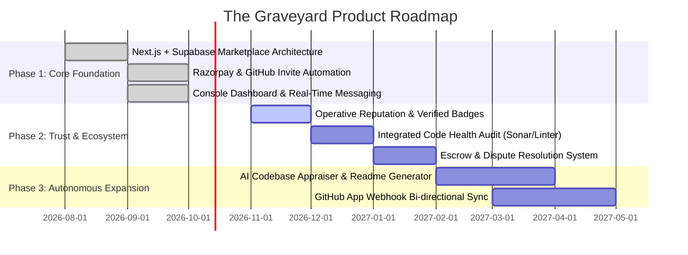

# Product Requirements Document (PRD)
## The Graveyard — Where Dead Code Lives Again

---

### Document Information
- **Product Name:** The Graveyard
- **Document Version:** 1.0.0
- **Status:** Approved / Active
- **Target Platform:** Web (Desktop & Mobile Responsive)
- **Core Technology Stack:** Next.js (App Router), Supabase (Auth, PostgreSQL, Storage), Tailwind CSS, Framer Motion, Razorpay API, GitHub REST API
- **Last Updated:** October 2026

---

## 1. Executive Summary & Vision

### 1.1 The Problem
Developers, indie hackers, and software engineers abandon countless side projects, prototypes, and minimum viable products (MVPs) each year. These codebases end up buried in private GitHub repositories or forgotten hard drives—representing thousands of hours of skilled engineering that yield zero value, monetization, or impact.
At the same time, thousands of entrepreneurs, indie builders, and early-stage founders spend weeks reinventing the wheel, seeking solid boilerplates, starter kits, or validated MVPs that they can build on immediately.

### 1.2 The Solution
**The Graveyard** is an industrial cyberpunk-themed developer marketplace and talent exchange designed to "resurrect dead code." It transforms abandoned, paused, or completed projects into liquid digital assets.
Sellers can monetize their dormant code or find successors; buyers can purchase high-quality software foundations; and builders can discover co-founders or collaborators to resurrect ambitious ideas together.

---

## 2. Target Personas & User Journeys

### 2.1 Personas

```
+---------------------------------------------------------------------------------------+
| 1. THE DRIFTER (Seller / Project Abandoner)                                          |
| Profile: Experienced engineer who builds fast prototypes but loses interest or time.  |
| Goal: Monetize unlaunched repositories or hand them over to passionate stewards.     |
| Pain Points: Feels guilty letting work rot; wants seamless payout without red tape.   |
+---------------------------------------------------------------------------------------+
| 2. THE SCAVENGER (Buyer / Indie Hacker)                                               |
| Profile: Builder or entrepreneur looking for fast time-to-market.                     |
| Goal: Purchase functional architectures, UI kits, or backend MVPs at fair prices.    |
| Pain Points: Tired of generic toy boilerplates; needs verified code and clean access. |
+---------------------------------------------------------------------------------------+
| 3. THE OPERATIVE (Collaborator / Co-founder)                                          |
| Profile: Full-stack builder or domain specialist looking for ambitious ideas.         |
| Goal: Join existing active projects that have a strong premise but lack bandwidth.    |
| Pain Points: Cold outreach on Twitter/Discord is chaotic; needs focused matching.     |
+---------------------------------------------------------------------------------------+
```

### 2.2 Primary User Journeys
1. **The Acquisition Journey (Buy):**
   - Buyer explores the terminal marketplace feed.
   - Filters by tech stack (e.g., Next.js, Supabase, Python) and interaction type (`buy`).
   - Inspects project details, views live demo links, inspects seller profile reputation.
   - Enters GitHub username and triggers the Razorpay modal.
   - Completes payment in INR; backend idempotently verifies payment signature, marks the project sold, invites the buyer to the private GitHub repository, and unlocks a secure direct file download.
2. **The Open Adoption Journey (Adopt):**
   - Developer spots an open-source project designated for free claim (`adopt`).
   - Clicks "Claim", authenticates via Supabase Auth.
   - Project is instantly recorded under their claimed inventory, granting instant access to source code and repo links.
3. **The Collaboration Journey (Collab):**
   - Operative identifies a project flagged as seeking a partner (`collab`).
   - Opens the collaboration modal, submits their pitch, contact information, portfolio/GitHub link.
   - Project owner receives an alert in their Operative Console, reviews the pitch, and connects via integrated peer-to-peer messaging.

---

## 3. Product Scope & Functional Requirements

### 3.1 Interaction Models Matrix

The Graveyard categorizes every listed repository under one of three strict interaction models:

| Interaction Type | Identifier | Price Rule | Fulfillment Mechanism | Primary Target Action |
|:---|:---|:---|:---|:---|
| **Buy** | `buy` | Fixed Price (`price > 0`, INR) | Razorpay checkout + Automated GitHub Collaborator Invitation + Secure Storage ZIP download | `Purchase` |
| **Adopt** | `adopt` | Free (`price == 0`) | Instant zero-cost transaction logging + Immediate source code download & repository access | `Claim` |
| **Collab** | `collab` | Custom / Flexible | Application pitch submission + Owner inbox review + In-app messaging | `Request Access` |

---

### 3.2 Feature Specifications

#### F-1: Cyberpunk Discovery Engine & Feed
- **F-1.1 Filter Bar:** Instant filtering by Interaction Mode (`All`, `For Sale`, `Free Fork`, `Seeking Partner`).
- **F-1.2 Tech Stack Tagging:** Multi-select filtering across predefined technology stacks (React, TypeScript, Next.js, Node.js, Python, Go, Rust, Supabase, Prisma, Docker, AWS, Firebase).
- **F-1.3 Search & Sorting:** Real-time text search across title and description; sorting by newest, views, and price.
- **F-1.4 Dynamic HUD Stats:** Real-time metrics counters displaying total projects resurrected, total transacted volume, and active operatives.

#### F-2: Project Listing & Publishing Pipeline
- **F-2.1 Project Metadata:** Title, rich description, primary tech stack array, external demo link.
- **F-2.2 Source Code Ingestion:**
  - *Option A: Direct Archive Upload:* Upload `.zip` or tarball directly to private Supabase Storage (`project-files` bucket) with upload progress indicators.
  - *Option B: GitHub Repository Link:* Provide public or private repository URI (`owner/repo`).
- **F-2.3 Commercial Parameters:** Pricing input (INR) validated against interaction type constraints.
- **F-2.4 Seller Contact Info:** Optional UPI ID, phone number, and social links stored in the seller's profile.

#### F-3: Checkout & Payment Settlement Engine
- **F-3.1 Order Generation (`/api/create-order`):** Server-side verification of project availability followed by creation of a verified Razorpay order instance.
- **F-3.2 Payment Modal & Client Gateway:** Razorpay Standard Checkout SDK loaded dynamically with custom cyberpunk theme configurations.
- **F-3.3 Payment Signature Verification (`/api/verify-payment`):**
  - Cryptographic verification using HMAC-SHA256 with `RAZORPAY_KEY_SECRET`.
  - Idempotency guard: Validates that transaction hasn't already been fulfilled.
  - Price & Currency Validation: Fetches order from Razorpay to guarantee client-side amounts were not manipulated.
- **F-3.4 Automated Fulfillment:**
  - Executes database transaction marking `is_sold = true`.
  - Dispatches automated GitHub collaborator invitation if a GitHub repository is linked.
  - Unlocks authorized download rights.

#### F-4: Secure Asset Delivery Gateway (`/api/secure-download`)
- **F-4.1 Authorization Barrier:** Validates that the requesting user is either the original project seller or a verified buyer with a `completed` transaction in the database.
- **F-4.2 Short-Lived Signed URLs:** Generates 60-second time-to-live (TTL) private Supabase storage URLs to prevent link leaks and unauthorized distribution.

#### F-5: Talent Collaboration Workflow
- **F-5.1 Collab Request Modal:** Modal for applicants to submit a structured pitch, background, and contact details.
- **F-5.2 Collab Status Management:** Project owners can accept, reject, or mark collaboration positions as filled (`is_collab_filled = true`).

#### F-6: Real-Time Peer-to-Peer Messaging
- **F-6.1 In-App Chat Interface:** Direct communication between buyers, sellers, and collaborators.
- **F-6.2 Privacy & Safety:** Soft-delete flags allowing users to hide conversations on their side without destroying historical evidence for disputes.

#### F-7: Operative Console (User Dashboard)
- **F-7.1 My Deployments (Seller Hub):** List of published projects with quick actions (Edit, Delete, Toggle Collab Filled, View Analytics).
- **F-7.2 Vault (Buyer Hub):** Archive of purchased and claimed projects with instantaneous download buttons and GitHub invitation status.
- **F-7.3 Transmission Center (Inbox):** Direct access to active negotiation threads and collaboration pitches.
- **F-7.4 Financial HUD:** Aggregated metrics showing total earnings, active transactions, and conversion rates.

---

## 4. Non-Functional Requirements (NFR)

### 4.1 Security & Integrity
- **NFR-1.1 Row Level Security (RLS):** 100% of database tables (`projects`, `profiles`, `transactions`, `messages`, `storage.objects`) must enforce strict PostgreSQL RLS policies.
- **NFR-1.2 Service Role Isolation:** Administrative privileges (`SUPABASE_SERVICE_ROLE_KEY`) must strictly reside within server-side API routes (`/api/*`) and must never leak to client bundles.
- **NFR-1.3 Storage Bucket Hardening:** The `project-files` bucket must be strictly non-public. Direct unauthenticated downloads must return HTTP 403 Forbidden.
- **NFR-1.4 Input Validation:** All API endpoints must parse and sanitize incoming payloads using Zod schemas before processing database queries or external API calls.

### 4.2 Performance & Availability
- **NFR-2.1 Page Load Speed:** First Contentful Paint (FCP) < 1.2s; Largest Contentful Paint (LCP) < 2.5s on desktop broadband.
- **NFR-2.2 Database Keep-Alive:** Scheduled Edge Cron job (`/api/cron`) pinging the database every 10 minutes to prevent auto-pausing on cloud tiers.
- **NFR-2.3 Asset Streaming:** Direct downloads must stream through high-speed edge signed URLs rather than buffering full archives in memory on serverless workers.

### 4.3 Aesthetics & Responsiveness
- **NFR-3.1 Cyberpunk Immersion:** The interface must strictly adhere to the industrial cyberpunk design system (dark backgrounds, neon indicators, monospace telemetry, clipped polygon edges).
- **NFR-3.2 Cross-Device Adaptability:** Responsive breakpoints (`sm`, `md`, `lg`, `xl`, `2xl`) supporting seamless mobile browsing down to 320px screen widths.

---

## 5. Success Metrics & Key Performance Indicators (KPIs)

| Metric | Target (Year 1) | Measurement Method |
|:---|:---|:---|
| **Resurrection Rate** | > 35% of listed projects claimed or bought | `COUNT(sold_projects) / COUNT(total_projects)` |
| **Gross Merchandise Volume (GMV)** | ₹1,000,000+ INR | Sum of `amount` in `completed` transactions |
| **Collab Match Rate** | > 25% of collab postings filled | `COUNT(collab_filled) / COUNT(collab_projects)` |
| **Delivery Success Rate** | 99.8% successful access/invites | Verified downloads + Successful GitHub invites |
| **Average Time to First Sale** | < 14 Days | Median time between `created_at` and completed transaction |

---

## 6. Product Roadmap & Future Horizons


